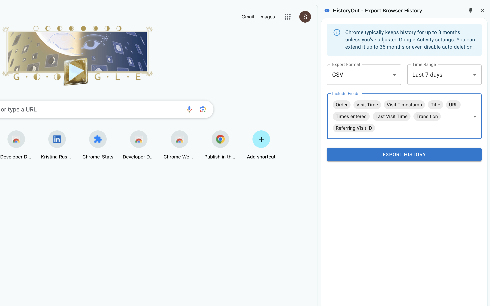

  
  <h1>{{ site.title }}</h1>
  
Export Chrome browsing history in various formats

  <a href="{{ site.data.urls.chrome_store }}" class="cta-button">Add to Chrome - It's Free</a>

  

  <h2>⭐ Key Features</h2>
  

    

      <h3>✅ Flexible Export Options</h3>
      
Choose from CSV, JSON, or HTML formats for your history export.

    

    

      <h3>✅ Customizable Date Ranges</h3>
      
Export history for the last 24 hours, a week, a month, or select a custom date range.

    

    

      <h3>✅ Tailored Output</h3>
      
Customize export details by selecting specific headers/keys to include in your output.

    

    

      <h3>✅ Saved Preferences</h3>
      
No need to reconfigure your settings every time; your last-used preferences are automatically saved.

    

    

      <h3>✅ Privacy First</h3>
      
Everything is processed locally in your browser. No data is sent or stored externally.

    

    

      <h3>✅ User-Friendly Interface</h3>
      
Simple, intuitive design for seamless exports.

    
  
  

  <h2>🔒 Privacy Note</h2>
  
HistoryOut operates entirely within your browser—your browsing history remains private and never leaves your device.

  <h2>⚠ Important Information</h2>
  
Chrome retains browsing history for up to 3 months by default, unless you've adjusted your Google Activity settings. Depending on your settings, you may be able to access history beyond 3 months—up to 36 months or indefinitely if auto-deletion is disabled. The "All Time" export option retrieves all available history within your browser.

  <h2>📥 Download HistoryOut today!</h2>
  
Take full control of your browsing history exports!

  <a href="{{ site.data.urls.chrome_store }}" class="cta-button">Add to Chrome</a>

