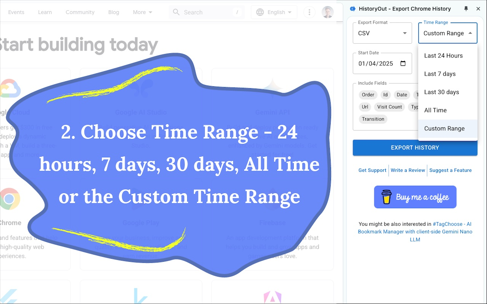
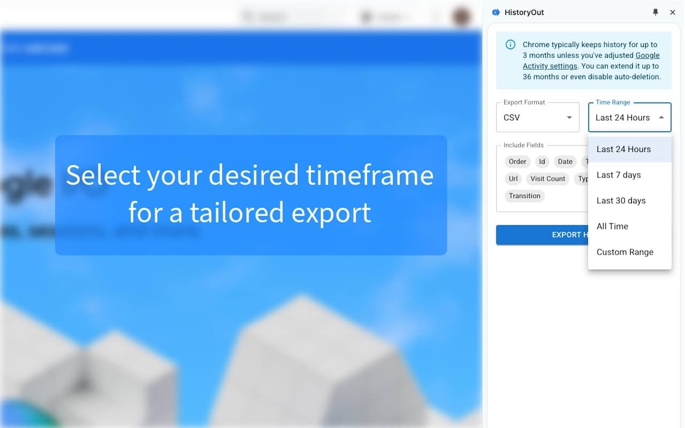
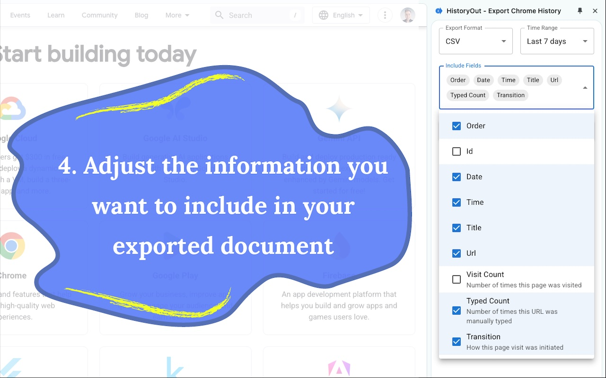
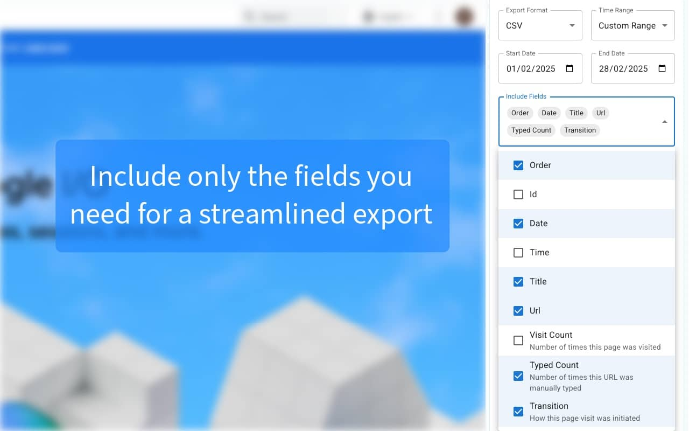

<h1 id="why-use-historyout">Why Use HistoryOut?</h1>

  

    
    

      <h3>Never Lose Important Pages</h3>
      
Stop saving every page "just in case." Export your browsing history and find pages easily when needed.

    

  

  

    
    

      <h3>Track Tasks and Research</h3>
      
Keep a record of research sessions and project work in formats you control.

    

  

  

    
    

      <h3>Analyze Your Browsing Patterns</h3>
      
Understand your online behavior and optimize your research workflow.

    

  

<h1 id="key-features">Key Features</h1>

  

    
    

      <h3>Multiple Export Formats</h3>
      
Export your history to CSV, JSON, or HTML formats for easy analysis and documentation.

    

  

  

    
    

      <h3>Choose Your Date Range</h3>
      
Export history from the last 24 hours, week, month, or select custom dates.

    

  

  

    
    

      <h3>Customize Your Export</h3>
      
Select which details to include: URLs, titles, visit counts, and more.

    

  

  

    
    

      <h3>Save Your Preferences</h3>
      
Your export settings are saved automatically for future use.

    

  

  

    
    

      <h3>Easy-to-Use Interface</h3>
      
Simple, clear design for quick and efficient exports.

    

  

  

    
    

      <h3>Privacy Protected</h3>
      
Your data stays in your browser - no uploads or external sharing.

    

  

<h1 id="how-historyout-works">How HistoryOut Works</h1>

  

    

      <h3>1. Select Export Format</h3>
      
    

  

  

    

      <h3>2. Choose Time Period</h3>
      
    

  

  

    

      <h3>3. Set Custom Dates</h3>
      
    

  

  

    

      <h3>4. Select Export Fields</h3>
      
    

  

