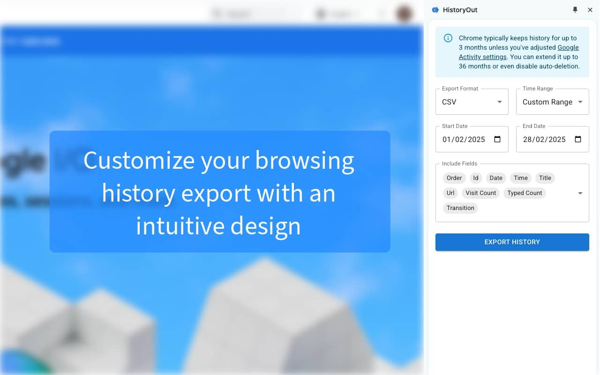

<main id="content" class="main-content" role="main">
  <h1 class="sr-only">
    About HistoryOut
  </h1>

  <article>
    <h2 id="how-historyout-works">How HistoryOut Works</h2> 
    
    <ol class="features-grid full-width">
      <li class="feature-card">
        

          <h3>1. Select Export Format</h3>
          
        

      </li>
    
      <li class="feature-card">
        

          <h3>2. Choose Time Period</h3>
          
        

      </li>
    
      <li class="feature-card">
        

          <h3>3. Set Custom Dates</h3>
          
        

      </li>
    
      <li class="feature-card">
        

          <h3>4. Select Export Fields</h3>
          
        

      </li>
    </ol>
  </article>

  <article>
    <h2 id="why-use-historyout">Why HistoryOut?</h2>
    
    <ul class="features-grid">
      <li class="feature-card">
        
        

          <h3>Custom Date Range Selection</h3>
          
Export exactly what you need from any specific time period.

        

      </li>
    
      <li class="feature-card">
        
        

          <h3>Adjustable Detail Levels</h3>
          
Choose how much info to include in your exports.

        

      </li>
    
      <li class="feature-card">
        
        

          <h3>Material UI Design</h3>
          
A smooth, familiar user experience.

        

      </li>

      <li class="feature-card">
        
        

          <h3>No Backend, No Tracking</h3>
          
Your data stays with you.

        

      </li>

      <li class="feature-card">
        
        

          <h3>Lightweight & Fast</h3>
          
Get your history in seconds.

        

      </li>

      <li class="feature-card">
        
        

          <h3>Multiple Export Formats</h3>
          
Excel-readable CSV, JSON, and HTML support.

        

      </li>

      <li class="feature-card">
        
        

          <h3>Saved Settings</h3>
          
No need to reconfigure export preferences every time.

        

      </li>
    </ul>

  </article>

  <aside>
    <h2 id="download-section" class="sr-only">Download HistoryOut</h2>
    
  </aside>

  <article>
    <h2 id="overview">Overview</h2>

    
Export Chrome History in Excel-readable CSV, JSON or HTML formats. Use custom date ranges and customize the output fields.

    
HistoryOut gives you full control over your history exports, allowing you to select custom date ranges instead of being limited to only "last 24h", "last 7 days" or "last month." Whether you need history from a specific day, specific week or month. In addition, HistoryOut lets you fine-tune the level of detail in your exports, giving you control over what information is included. Your export settings are saved between sessions, so you don’t have to reconfigure them every time. HistoryOut lets you export exactly what you need—nothing more, nothing less.⠀⠀

    
🔐 100% Private – No Backend, No Data Collection⠀⠀

    
HistoryOut runs entirely within your browser, meaning no data is sent or stored on external servers. There’s no backend, no tracking, and no third-party access. Everything stays on your device.

    
📂 Export in CSV, JSON, or HTML – With Fully customisable Detail Levels

    
Whether you need a full breakdown with URLs, titles, and timestamps or just a simple list of visited sites, you decide. Your export settings are saved between sessions, so you don’t have to reconfigure them every time. HistoryOut lets you export browsing history in multiple formats, so you can choose the one that best fits your needs:

    <ul>
      <li>CSV – Easily open and analyse history in Excel or Google Sheets 📊</li>
      <li>JSON – Ideal for developers or structured data processing 🛠️</li>
      <li>HTML – Save and browse your history like a webpage 🔍</li>
      <li>A Modern UI That Feels Familiar</li>
    </ul>

    
Built with Google’s Material UI (MUI) components, HistoryOut provides a smooth, intuitive interface that feels like a natural extension of Chrome.

    
Take control of your browsing history—privately, securely, and with flexibility. Try HistoryOut today! 🚀

  </article>
</main>
