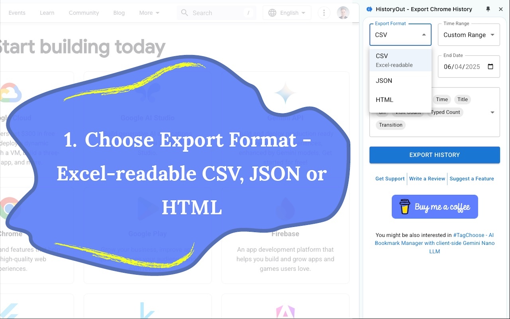
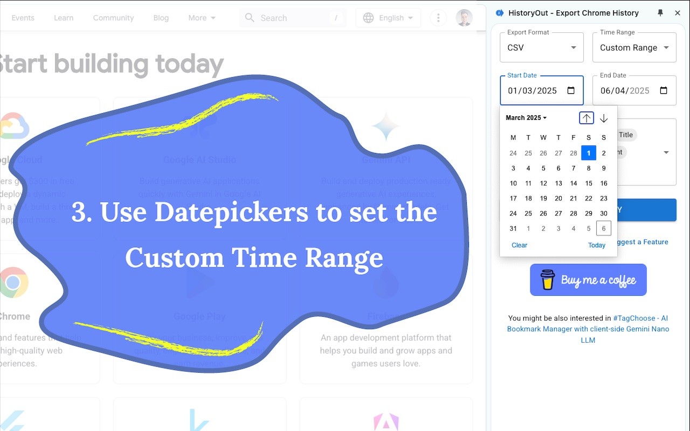

<main id="content" class="main-content" role="main">
  <h1 class="sr-only">
    About HistoryOut - Export Chrome History Extension
  </h1>
  
  <article>
    <h2 id="how-historyout-works">How HistoryOut Works</h2> 
    
    <ol class="features-grid full-width">
      <li class="feature-card">
        

          <h3>1. Select Export Format</h3>
          
        

      </li>
    
      <li class="feature-card">
        

          <h3>2. Choose Time Period</h3>
          
        

      </li>
    
      <li class="feature-card">
        

          <h3>3. Set Custom Dates</h3>
          
        

      </li>
    
      <li class="feature-card">
        

          <h3>4. Select Export Fields</h3>
          
        

      </li>
    </ol>
  </article>

  <article>
    <h2 id="why-use-historyout">Why HistoryOut?</h2>
    
    <ul class="features-grid">
      <li class="feature-card">
        
        

          <h3>Never Lose Important Pages</h3>
          
Stop saving every page "just in case." Export your browsing history and find pages easily when needed.

        

      </li>
    
      <li class="feature-card">
        
        

          <h3>Track Tasks and Research</h3>
          
Keep a record of research sessions and project work in formats you control.

        

      </li>
    
      <li class="feature-card">
        
        

          <h3>Analyze Your Browsing Patterns</h3>
          
Understand your online behavior and optimize your research workflow.

        

      </li>
    </ul>
  </article>

  <aside>
    <h2 id="download-section" class="visually-hidden">Download HistoryOut</h2>
    
  </aside>

  <article>
    <h2 id="key-features">Key Features</h2>
    
    <ul class="features-grid">
      <li class="feature-card">
        
        

          <h3>Multiple Export Formats</h3>
          
Export your history to CSV, JSON, or HTML formats for easy analysis and documentation.

        

      </li>
    
      <li class="feature-card">
        
        

          <h3>Choose Your Date Range</h3>
          
Export history from the last 24 hours, week, month, or select custom dates.

        

      </li>
    
      <li class="feature-card">
        
        

          <h3>Customize Your Export</h3>
          
Select which details to include: URLs, titles, visit counts, and more.

        

      </li>
    
      <li class="feature-card">
        
        

          <h3>Save Your Preferences</h3>
          
Your export settings are saved automatically for future use.

        

      </li>
    
      <li class="feature-card">
        
        

          <h3>Easy-to-Use Interface</h3>
          
Simple, clear design for quick and efficient exports.

        

      </li>
    
      <li class="feature-card">
        
        

          <h3>Privacy Protected</h3>
          
Your data stays in your browser - no uploads or external sharing.

        

      </li>
    </ul>
  </article>
</main>
